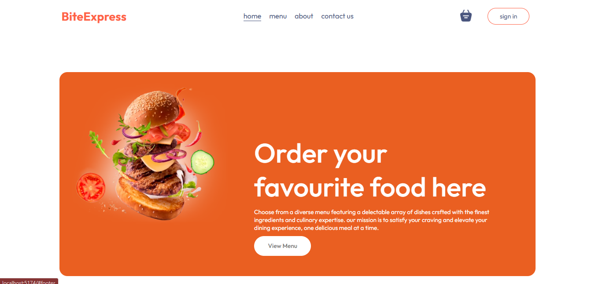
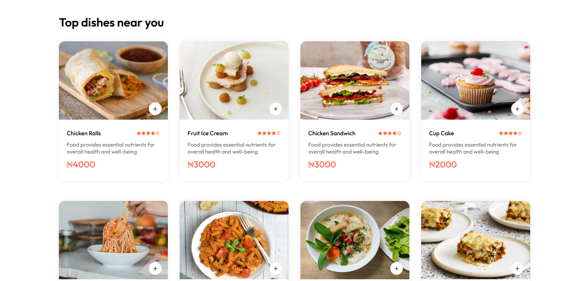
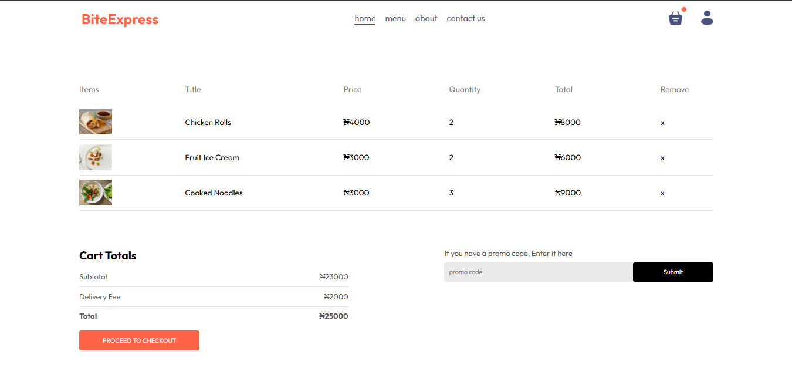
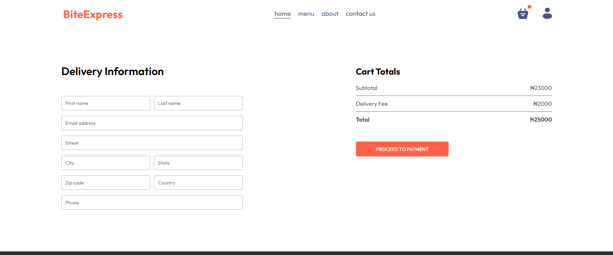
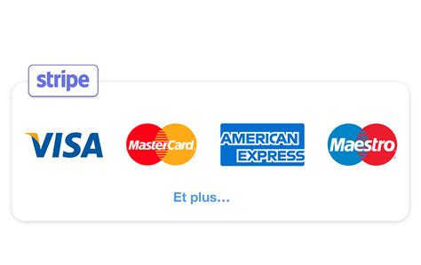
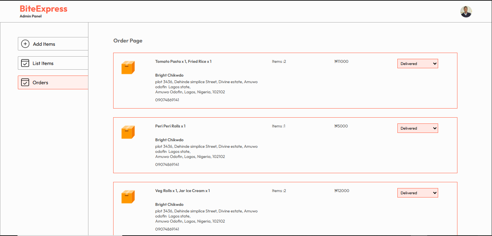
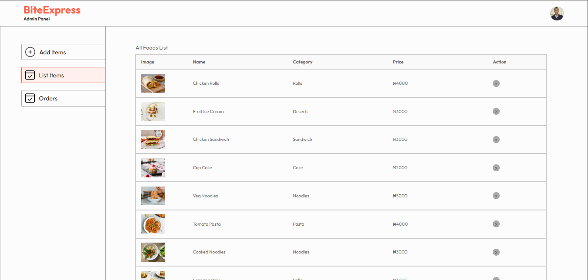
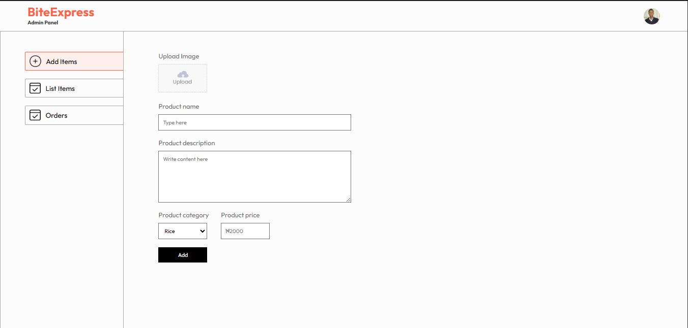

# BiteExpress 🍔🚀  

**Your ultimate food delivery app!** Order from local restaurants, enjoy seamless checkout, and track deliveries in real-time. Built with modern web technologies and secure payments via Stripe.  

 

---

## Features ✨  

### For Users  
- 🍽️ **Browse Food Items**: Filter by cuisine, price, or dietary preferences.  
- 🛒 **Order Management**: Add/remove items, customize orders.  
- 💳 **Secure Payments**: Stripe integration for credit/debit cards.  
- 📍 **Real-Time Tracking**: Track your order status (future enhancement).  
- ⭐ **Ratings & Reviews**: Rate restaurants and dishes (future enhancement).  

### For Admins  
- 🛠️ **Admin Panel**: Manage orders, products, and restaurants.  
- 📊 **Dashboard**: View sales analytics (future enhancement).  
- ➕ **Add Products**: Upload images, set prices, and manage inventory.  

---

## Pages 🖥️  

### 1. Home Page  
  
- Featured restaurants, promotions, and search functionality.  

### 2. Food Items Page  
  
- List of dishes with filters (veg/non-veg, price range).  

### 3. Order Page  
  
- Cart summary and order customization.  

### 4. Checkout Page  
  
- Address selection and order review.  

### 5. Payment Page (Stripe)  
  
- Secure card input and payment processing.  

### 6. Admin Panel  
#### All Orders  
  
- View, cancel, or update order statuses.  

#### All Products  
  
- Edit/delete existing menu items.  

#### Add Product  
  
- Upload new items with images and descriptions.  

---

## Technologies Used 💻  
- **Frontend**: React.js, Tailwind CSS  
- **Backend**: Node.js, Express  
- **Database**: MongoDB  
- **Authentication**: JWT  
- **Payments**: Stripe API  
- **Deployment**: Vercel (Frontend), Render (Backend)  

---

## Setup Instructions 🛠️  

1. **Clone the repository**:  
   ```bash
   git clone https://github.com/JoeCode001/Food-Delivery-e-commerce-.git
   cd Food-Delivery-e-commerce-
